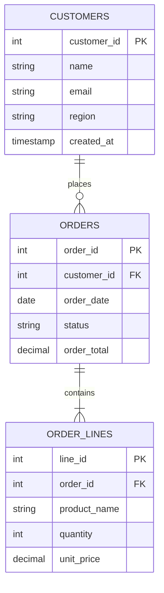

# SQL Tutorial 1: Setting Up Your SQL Playground

> **Official Companion Guide for [Analytics Made Simple: Tutorial 1 - Setting Up SQL](https://analyticsmadesimple.com/tutorials/tutorial-1-setting-up-sql/)**

To master SQL, you need a safe environment where you can execute queries, inspect schemas, and break things without consequences.

---

## Database Schema Diagram



---

## Running in SQLite

SQLite is pre-installed on macOS and Linux.

```bash
# Initialize playground database
sqlite3 ams_playground.db < sql/01_playground_setup.sql

# Open interactive shell
sqlite3 ams_playground.db
```

Within the SQLite shell:
```sql
.tables
.schema customers
SELECT * FROM customers;
.quit
```

## Running in DuckDB

```bash
# Open DuckDB memory database and execute script
duckdb -c ".read sql/01_playground_setup.sql"
```

👉 Next: [Part 2: Master the Core Commands](./02_core_commands.md)
