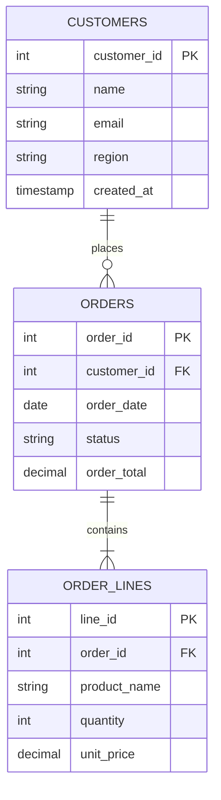

# SQL Tutorial 1: Setting Up Your SQL Playground

> **Official Companion Guide for [Analytics Made Simple: Tutorial 1 - Setting Up SQL](https://analyticsmadesimple.com/tutorials/tutorial-1-setting-up-sql/)**
> Raw Script: [`01_playground_setup.sql`](./01_playground_setup.sql)

To master SQL, you need a safe environment where you can execute queries, inspect schemas, and break things without consequences. This tutorial creates an in-memory or file-backed database with three core business tables.

---

## Database Schema Diagram



---

## The Complete Setup Script

Below is the full SQL setup script contained in [`01_playground_setup.sql`](./01_playground_setup.sql). It establishes table structures, enforces foreign keys, and seeds sample data:

```sql
-- Analytics Made Simple (analyticsmadesimple.com)
-- Tutorial 1: Setting Up Your SQL Playground (https://analyticsmadesimple.com/tutorials/tutorial-1-setting-up-sql/)
-- License: MIT

-- 1. Create Customers Table
CREATE TABLE IF NOT EXISTS customers (
    customer_id INTEGER PRIMARY KEY,
    name TEXT NOT NULL,
    email TEXT UNIQUE,
    region TEXT NOT NULL,
    created_at TIMESTAMP DEFAULT CURRENT_TIMESTAMP
);

-- 2. Create Orders Table
CREATE TABLE IF NOT EXISTS orders (
    order_id INTEGER PRIMARY KEY,
    customer_id INTEGER NOT NULL,
    order_date DATE NOT NULL,
    status TEXT NOT NULL CHECK (status IN ('completed', 'pending', 'cancelled')),
    order_total DECIMAL(10, 2) NOT NULL,
    FOREIGN KEY (customer_id) REFERENCES customers(customer_id)
);

-- 3. Create Order Lines Table
CREATE TABLE IF NOT EXISTS order_lines (
    line_id INTEGER PRIMARY KEY,
    order_id INTEGER NOT NULL,
    product_name TEXT NOT NULL,
    quantity INTEGER NOT NULL CHECK (quantity > 0),
    unit_price DECIMAL(10, 2) NOT NULL,
    FOREIGN KEY (order_id) REFERENCES orders(order_id)
);

-- 4. Insert Sample Customers
INSERT INTO customers (customer_id, name, email, region, created_at) VALUES
(1, 'Acme Industrial', 'ops@acmeind.com', 'North America', '2025-01-10 09:00:00'),
(2, 'Apex Logistics', 'dispatch@apexlog.com', 'Europe', '2025-01-15 11:30:00'),
(3, 'Beacon Health', 'admin@beaconhlth.org', 'North America', '2025-02-01 14:15:00'),
(4, 'Crestview Retail', 'orders@crestview.com', 'Asia-Pacific', '2025-02-12 16:45:00'),
(5, 'Delta Dynamics', 'billing@deltadyn.io', 'Europe', '2025-03-01 10:00:00');

-- 5. Insert Sample Orders
INSERT INTO orders (order_id, customer_id, order_date, status, order_total) VALUES
(101, 1, '2025-02-10', 'completed', 1450.00),
(102, 1, '2025-02-25', 'completed', 820.00),
(103, 2, '2025-03-01', 'completed', 3100.00),
(104, 3, '2025-03-05', 'pending', 450.00),
(105, 4, '2025-03-12', 'completed', 1980.00),
(106, 2, '2025-03-15', 'cancelled', 650.00);

-- 6. Insert Sample Order Lines
INSERT INTO order_lines (line_id, order_id, product_name, quantity, unit_price) VALUES
(1, 101, 'Sensor Kit Pro', 2, 500.00),
(2, 101, 'Connector Cable 5m', 9, 50.00),
(3, 102, 'Mounting Bracket', 4, 205.00),
(4, 103, 'Industrial Gateway', 1, 2500.00),
(5, 103, 'Calibration Module', 2, 300.00),
(6, 104, 'Power Supply Unit', 3, 150.00),
(7, 105, 'Sensor Kit Pro', 3, 500.00),
(8, 105, 'Connector Cable 5m', 8, 60.00);

-- 7. Verification Query
SELECT 
    c.name AS customer_name,
    o.order_id,
    o.order_date,
    o.status,
    o.order_total
FROM customers c
JOIN orders o ON c.customer_id = o.customer_id
ORDER BY o.order_id;
```

---

## Code Breakdown

1. **Constraints Protect Data Quality:** Notice the `CHECK (status IN ('completed', 'pending', 'cancelled'))` and `CHECK (quantity > 0)` constraints. They guarantee that invalid statuses or negative quantities can never enter the database.
2. **Foreign Key Integrity:** `FOREIGN KEY (customer_id) REFERENCES customers(customer_id)` prevents orphaned orders that don't belong to any registered client.
3. **Automatic Timestamps:** `created_at TIMESTAMP DEFAULT CURRENT_TIMESTAMP` logs row creation time without requiring manual input.

---

## Expected Verification Output

When the script runs the final verification query, it outputs:

| customer_name | order_id | order_date | status | order_total |
|:---|:---|:---|:---|:---|
| Acme Industrial | 101 | 2025-02-10 | completed | $1,450.00 |
| Acme Industrial | 102 | 2025-02-25 | completed | $820.00 |
| Apex Logistics | 103 | 2025-03-01 | completed | $3,100.00 |
| Beacon Health | 104 | 2025-03-05 | pending | $450.00 |
| Crestview Retail | 105 | 2025-02-12 | completed | $1,980.00 |
| Apex Logistics | 106 | 2025-03-15 | cancelled | $650.00 |

---

## How to Run

### Option A: SQLite (Built-in on macOS and Linux)
```bash
# Initialize playground database
sqlite3 ams_playground.db < sql/01_playground_setup.sql

# Open interactive shell
sqlite3 ams_playground.db
```

Within the SQLite prompt:
```sql
.tables
.schema customers
SELECT * FROM customers;
.quit
```

### Option B: DuckDB
```bash
duckdb -c ".read sql/01_playground_setup.sql"
```

👉 Next: [Part 2: Master the Core Commands](./02_core_commands.md)
